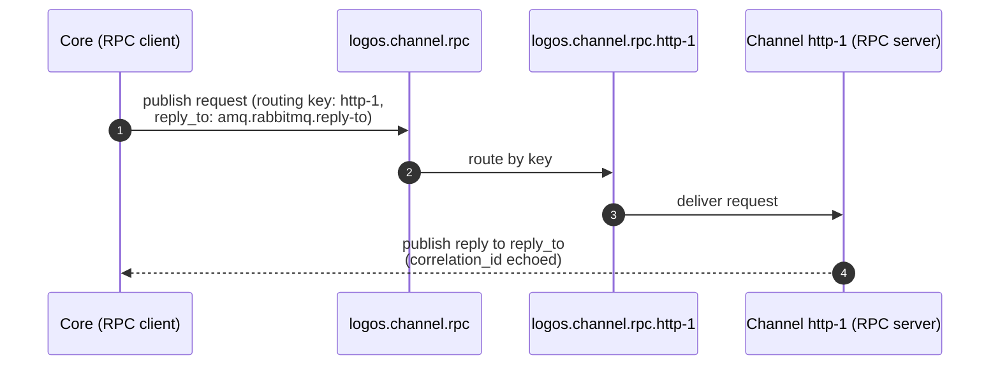

This page freezes the RabbitMQ exchange, queue, and routing-key naming strategy
for the control plane. It resolves the "exchange/queue naming conventions and
routing-key strategy" item from the [Architecture Draft](../../architecture/#pending-decisions)

All names are lowercase, dot-separated, and prefixed with `logos.` to namespace
the platform on a shared broker.

## Exchanges

| Exchange | Type | Purpose |
|---|---|---|
| `logos.core.rpc` | `direct` | Module → core RPC requests (lifecycle: register/heartbeat/deregister). |
| `logos.channel.rpc` | `direct` | Core → channel RPC requests (channel management). |
| `logos.factory.rpc` | `direct` | Core ↔ minion-factory RPC (build coordination). |
| `logos.events` | `topic` | Module → core event notifications (fan-in). |

RPC uses **direct** exchanges so a request is routed to exactly one target
instance by routing key. Events use a **topic** exchange so core can subscribe
to event classes with wildcards.

## RPC: request/reply

RPC ownership is **per-operation** — the control plane runs in both directions.
The party that *receives* an operation is the RPC **server** and owns a durable
request queue; the *caller* is the RPC **client**.

| Operation class | Client | Server (owns queue) |
|---|---|---|
| Lifecycle (`module.*`) | module | **core** — `logos.core.rpc` |
| Management (channel configuration, ...) | core | **module** — `logos.<module-type>.rpc.<instance>` |

A module learns *its own* server queue name by convention (below); core learns a
module's server queue from the `rpc_queue` field the module sends at
[registration](../module-lifecycle/#moduleregister). Both directions reply via
the same direct reply-to mechanism, with the caller setting `reply_to`.

### Core request queue

Core's lifecycle server uses a single shared queue with competing consumers
across core instances:

```
logos.core.rpc
```

bound to exchange `logos.core.rpc` with routing key `core`.

### Module request queue

Each module instance owns a durable request queue and consumes from it:

```
logos.<module-type>.rpc.<instance>
```

bound to the matching RPC exchange with routing key `<instance>`.

Examples:

- `logos.channel.rpc.http-1` bound to `logos.channel.rpc` with key `http-1`
- `logos.channel.rpc.telegram-2` bound to `logos.channel.rpc` with key `telegram-2`

### Replies

Replies use RabbitMQ **direct reply-to** — the client sets the request's
`reply_to` property to the pseudo-queue `amq.rabbitmq.reply-to` and the server
publishes the reply to that address. The reply's `correlation_id` equals the
request's `correlation_id`. No per-call reply queue is declared.



### Message properties

In addition to the [envelope](../amqp-envelope/) body, RPC requests set standard
AMQP properties:

| Property | Value |
|---|---|
| `reply_to` | `amq.rabbitmq.reply-to` |
| `correlation_id` | same ULID as the envelope `correlation_id` |
| `content_type` | `application/json` |
| `type` | the envelope `type` (e.g. `module.config.update`) |

## Events: publish/subscribe

Modules publish events to the `logos.events` topic exchange. Routing keys are
hierarchical:

```
<module-type>.<instance>.<event>
```

Examples:

- `channel.http-1.config.updated`
- `channel.http-1.sync.unmatched`
- `factory.go-1.build.completed`

Core binds subscriber queues with wildcards:

- `channel.*.config.*` — all channel config events
- `factory.*.build.*` — all factory build events
- `#` — everything (audit sink)

## Reliability

- **Durable** request queues and exchanges survive broker restart.
- **Dead-letter**: each RPC request queue declares a dead-letter exchange
  `logos.dlx` (topic) for messages that are rejected or exceed delivery limits,
  satisfying the reliability requirement from
  [core-infrastructure.md](../../core-infrastructure/#rabbitmq--message-bus).
- **Per-queue ACLs** enforce trust boundaries: a channel instance may consume
  only its own RPC queue and publish only to `logos.events`.

## Naming summary

| Kind | Pattern | Example |
|---|---|---|
| RPC exchange | `logos.<surface>.rpc` | `logos.channel.rpc`, `logos.core.rpc` |
| Core RPC queue | `logos.core.rpc` (routing key `core`) | `logos.core.rpc` |
| Module RPC request queue | `logos.<module-type>.rpc.<instance>` | `logos.channel.rpc.http-1` |
| Module RPC routing key | `<instance>` | `http-1` |
| Event exchange | `logos.events` | `logos.events` |
| Event routing key | `<module-type>.<instance>.<event>` | `channel.http-1.config.updated` |
| Dead-letter exchange | `logos.dlx` | `logos.dlx` |
