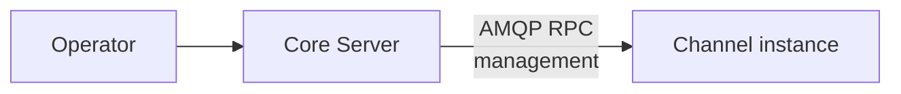

This is the **control-plane** contract between core and a channel module: how
core manages a channel's configuration over RabbitMQ RPC.

It builds on the shared [AMQP envelope](../amqp-envelope/) and
[routing conventions](../amqp-conventions/). For the data-plane (minion traffic)
contract between the same parties, see
[Channel ↔ Core: HTTP Sync](../channel-core-sync/).

## Roles and ownership

For **these management operations**, the direction is core → channel (the control
plane as a whole is bidirectional — lifecycle runs the other way, see
[Module Lifecycle](../module-lifecycle/)):

- **Core is the RPC client.** It owns the management UX/API and policy decisions.
- **The channel is the RPC server.** It owns runtime behavior, local configuration
  storage, and is the system-of-record for its own state.

:::note[Prerequisite]
Core can only address a channel that has already registered. A channel sends
[`module.register`](../module-lifecycle/#moduleregister) on startup — including
the `rpc_queue` core should call it back on — before any management RPC can be
issued.
:::

## Transport

| Aspect | Value |
|---|---|
| Exchange | `logos.channel.rpc` (direct) |
| Routing key | target channel `<instance>` (e.g. `http-1`) |
| Request queue | `logos.channel.rpc.<instance>` |
| Reply | direct reply-to (`amq.rabbitmq.reply-to`), `correlation_id` echoed |
| Body | [AMQP envelope](../amqp-envelope/) / RPC reply envelope |

All operations are request/reply. The `type` field selects the operation.

## Scope

Core uses this RPC surface to manage channel-internal configuration. The exact
set of operations a channel exposes depends on its implementation. Channels
built on `logos-golang-channel-core` expose profile CRUD operations; other
channel implementations may define a different management surface.

The data-plane envelope contract ([HTTP Sync](../channel-core-sync/)) is what
core depends on. This management RPC is an operational convenience — it does not
affect the envelope format.

## Shared rules

- Mutating operations are **idempotent on `message_id`**: a redelivered request
  with the same `message_id` must not apply the change twice.
- Channels emit audit events to `logos.events` on configuration changes.

## Error codes

| Code | Meaning |
|---|---|
| `validation_failed` | Malformed request or invalid configuration. |
| `not_found` | Referenced configuration item does not exist. |
| `conflict` | Change would create an invalid state. |
| `internal_error` | Unexpected channel-side failure (storage I/O, etc.). |

## Auditing

Configuration changes are security-relevant. Channels emit events to
`logos.events` on every successful mutation (see
[routing conventions](../amqp-conventions/#events-publishsubscribe)).

Each event payload carries the originating `correlation_id` and the actor
identity propagated by core in the triggering request.
