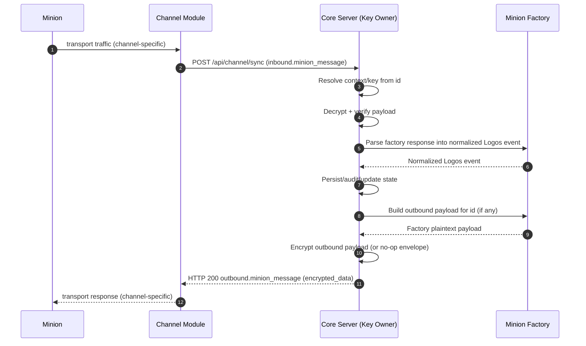

End-to-end flow across all major components.

## End-to-End Sequence

## Notes

- `minion ↔ core Server` is the logical protocol conversation.
- Channel is a transport relay — it delivers canonical envelopes and remains plaintext-blind.
- Minion Factory is an internal core-side processing layer.
- How a channel extracts `id` + `encrypted_data` from its transport, or embeds
  the response back, is the channel's implementation detail. Core only sees the
  canonical envelopes defined in [Channel ↔ Core: HTTP Sync](./contracts/channel-core-sync/).
