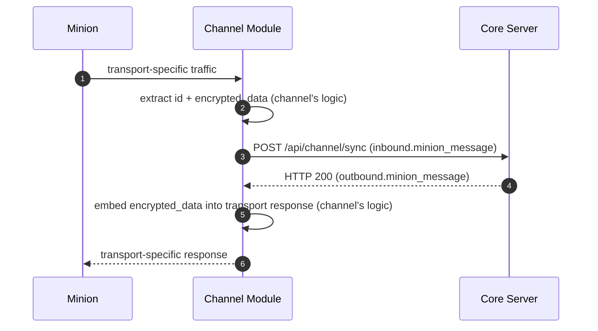

This page documents the **channel-to-core data-plane flow** — how a minion's
traffic reaches core and how core's response gets back.

## Envelope-Centric View

The core Server defines one contract surface for all channel modules: a pair of
canonical JSON envelopes exchanged over HTTP. How a channel module receives
traffic from a minion, what transport it uses, and how it extracts or embeds
fields is **the channel's concern and out of scope for core**.

Core sees only:

1. An `inbound.minion_message` envelope arriving at `POST /api/channel/sync`.
2. An `outbound.minion_message` envelope returned in the HTTP response.

## What Core Requires

A well-formed `inbound.minion_message` with:

- `id` — identifies the minion session.
- `encrypted_data` — opaque blob, never inspected by the channel.
- `source.module_instance` — the registered channel instance sending it.
- Standard envelope fields (`message_id`, `type`, `version`, `timestamp`).

See [Channel ↔ Core: HTTP Sync](./contracts/channel-core-sync/) for the full
envelope schema.

## What Core Returns

An `outbound.minion_message` with:

- The same `id` for correlation.
- `encrypted_data` — opaque response blob (or empty/no-op when nothing is pending).

## Channel Boundaries

- Channel does **not** decrypt payload plaintext.
- Channel does **not** execute core business logic.
- Channel does **not** own minion-factory semantics.
- How a channel maps transport fields to/from the canonical envelope is an
  implementation detail invisible to core.
